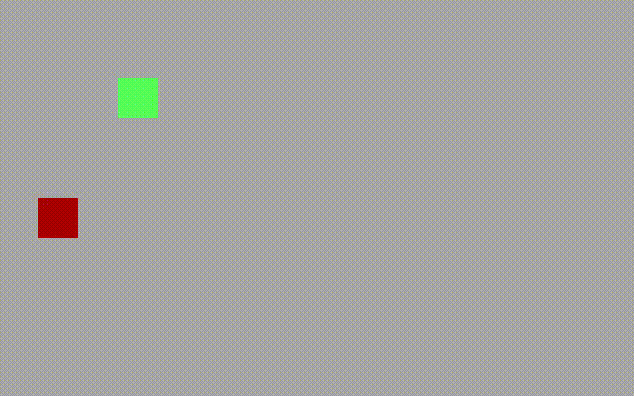

# Slug

A 512-byte x86 bootsector game.

## Running `slug`

Run `make` to build the `slug.bin` disk image. You can run the game in QEMU using `make qemu`.

## Controls

Use `h`, `j`, `k`, `l` to move the slug around.
